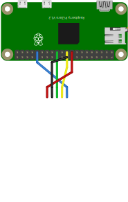

# WiFi Monitor

> A Raspberry Pi based internet speed monitor

`git clone https://github.com/ollyoid/WiFi_Monitor.git `

`cd WiFi_Monitor/src`

`sudo apt-get install python3-pil`

`pip3 install -r requirements.txt`

`python3 monitor.py`

# Hardware
* [Raspberry Pi Zero W](https://www.raspberrypi.com/products/raspberry-pi-zero-w/)
* [Adafruit SHARP Memory Display Breakout - 2.7" 400x240 Monochrome](https://www.adafruit.com/product/4694)

3D printing files can be found in `hw/3d_files`.
